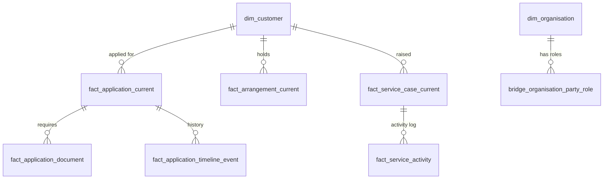
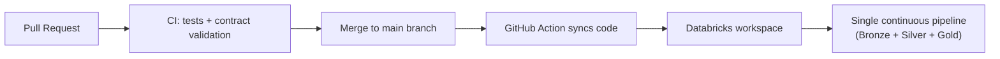

# Implementation Pipelines

## 1. Stage 1: Source to Bronze

### 2.1 What "source" means here

Business data originates from three different kinds of systems, and each is ingested differently because each behaves differently:

| Source type | Example data | How it changes | How we capture it |
|---|---|---|---|
| **Operational database** | Customer records, loan applications, bank accounts, balances | Rows are inserted, updated, and deleted continuously | **Change Data Capture (CDC)** via Debezium reads the database's internal transaction log and streams every insert, update, and delete as it happens, all without querying the live database and slowing it down |
| **Business events** | "Application moved to a new stage", "Customer contacted support" | Facts that happen once and never change | Published as messages on **Apache Kafka**, a real-time event-streaming system |
| **Reference / periodic files** | Accepted loan exports, product catalogs | Delivered as whole files on a schedule | Dropped as files directly into cloud storage |

> **Plain-language summary:** think of CDC as a security camera pointed at the database's diary, recording every change the instant it happens, in order, without disturbing the database itself. Events are like a news wire, sending one-off announcements of things that occurred. Files are like a courier delivery, bringing a full package that arrives on a schedule.

### 2.2 The landing zone: an immutable audit trail

Before anything touches Databricks, every source record is written, unchanged, into an **S3 landing zone**, which is a plain folder structure in AWS. This is deliberate:

- It is **immutable**: nothing already written is ever modified.
- It is the **rerun boundary**: if a downstream table is ever accidentally corrupted, we can always rebuild it from this untouched copy, because nothing here is ever thrown away.
- It keeps a byte-for-byte original of every file and every change event, which matters for audits and dispute resolution.

```text
s3://<bucket>/bronze/landing/
├── cdc/<dataset>/        raw database change records (Debezium envelope)
├── event/<dataset>/      raw business events (Kafka payloads)
├── file/<dataset>/       raw source files, untouched
├── quarantine/<source>/  malformed/unparseable records that failed basic transport checks
└── manifests/            delivery receipts used to prove nothing was lost or duplicated
```

### 2.3 From landing zone into Bronze tables

A Databricks feature called **Auto Loader** watches the landing zone continuously and, within about a minute, picks up any new file and loads it into a **Bronze table**, which is a live, queryable Delta table inside Databricks' governed catalog (Unity Catalog).

Bronze tables in this platform follow one consistent design principle: **they are "source-aligned," not "business-ready."** That means:

- **No business logic is applied yet.** No deduplication, no merging, no renamed fields, no filtering of "irrelevant" data.
- **Every record that arrived is kept**, including duplicates and older versions, because Bronze is *append-only* (rows are only ever added, never changed or deleted).
- Each table records exactly what kind of change it represents (insert, update, delete, or initial snapshot) and where it came from (which file, which Kafka offset, which database transaction position), so nothing is a mystery later.
- Records that don't even structurally parse (e.g. corrupted JSON) are automatically set aside in a small holding table instead of silently vanishing or crashing the pipeline. This is just a transport-level safety net; the platform's dedicated quarantine mechanism is introduced in the Bronze-to-Silver stage below.

One Bronze table is created per source dataset, using a simple naming convention:

| Prefix | Meaning | Example |
|---|---|---|
| `cdc_<dataset>` | Database change history | `cdc_loan_applications`, `cdc_customers` |
| `event_<dataset>` | Business event history | `event_application_stage_history` |
| `file_<dataset>` | Row-level file contents | `file_accepted_loans` |

Two extra "control" tables keep the whole ingestion layer honest:

- `control_ingestion_manifests` is a receipt log used to prove that record counts, checksums, and delivery timing match expectations (nothing lost, nothing duplicated).
- `ingestion_quarantine` holds records that failed even basic structural parsing, kept for investigation instead of being silently dropped. It lives inside Bronze itself and is separate from the dedicated `quarantine` schema described in the next stage.

**Simplified example** (Python, using Databricks' declarative pipeline framework):

```python
@dp.table(
    name="cdc_customers",
    table_properties={"quality": "bronze", "delta.appendOnly": "true"},
)
def source_aligned_cdc_table():
    return (
        read_stream_from_landing("cdc", "customers")
        .select(
            "record.*",
            F.when(F.col("payload.op") == "c", "INSERT")
             .when(F.col("payload.op") == "u", "UPDATE")
             .when(F.col("payload.op") == "d", "DELETE")
             .alias("_operation"),
            F.col("payload.source.lsn").alias("_source_lsn"),   # database position, for exact replay
            F.current_timestamp().alias("_ingested_at"),
        )
    )
```

### What Bronze guarantees

| Guarantee | Why it matters |
|---|---|
| Every record the source ever sent is retained, unaltered | Full auditability; nothing is lost to a bug in later logic |
| Records are traceable to their exact origin (file, offset, transaction position) | Enables precise root-cause investigation and reprocessing |
| Malformed records are set aside for review, not dropped | Nothing disappears silently |
| Bronze is classified as **Protected data** | It is never exposed directly to end users, dashboards, or AI, because it is a working layer rather than a product |

---

## 3. Stage 2: Bronze to Silver

Bronze answers "what did the source send us." **Silver answers "what is actually true right now."** This is where raw evidence becomes a validated, trustworthy business record.

### 3.1 What happens in this stage

Four things happen to every dataset as it moves from Bronze into Silver:

1. **Validation against a data contract.** Every Silver table has an explicit, version-controlled *data contract*, which is a YAML document that defines the expected schema, required fields, valid value ranges, and business rules (e.g. "an application's last-updated timestamp must not be earlier than its submitted timestamp"). Records that break a "hard" rule are excluded from Silver and routed to a dedicated `quarantine` schema instead, so the rejection stays visible and traceable rather than a silent drop. This `quarantine` schema, separate from Bronze, Silver, and Gold, is the platform's real quarantine layer: it holds every record that failed a contract rule, plus any cross-entity dependency violations found once related entities are compared (see §3.4). Bronze's own holding table, by contrast, only catches records that failed to parse structurally, before this kind of validation is even possible.
2. **Deduplication and current-state resolution.** A database table might send us five updates to the same customer row throughout the day. Silver resolves this down to one current, correct row per business key, using the source's own ordering information (transaction position, timestamps) to know which update is genuinely the latest.
3. **History tracking (where it matters).** For entities where "how did this change over time" is a real business question, such as a customer's profile or a loan application's status, Silver keeps a **full change history**, not just the latest value. This is done using a well-established pattern called **SCD Type 2** (Slowly Changing Dimension, Type 2): each historical version of a row is kept, tagged with the time range during which it was the "current" truth. This lets us later ask "what did we believe about this customer on the 3rd of March?" not just "what do we believe today."
4. **Protecting sensitive data.** Personally identifiable information (PII) is masked or tokenized on the way into Silver, before it is ever queryable.

### 3.2 Two shapes of Silver table

Not every entity needs full history. The platform uses two patterns, chosen per entity based on its real-world behavior:

| Pattern | Used for | Behavior |
|---|---|---|
| **SCD Type 2 (mutable entities)** | Customers, organisations, loan applications, accounts, KYC records | Keeps every historical version with a validity window; you can query "as of" any past moment |
| **Append-only (immutable entities)** | Stage-history events, status changes, support interactions | Records are facts that happened once and are simply appended, deduplicated only to remove accidental repeats |

Internally, Databricks' **Auto CDC** feature (the modern successor to what used to be called "Change Data Capture merge" logic) automatically applies inserts, updates, and deletes from the Bronze change feed into the correct SCD2 shape, so engineers do not have to hand-write merge or upsert logic.

**Simplified example**, publishing a validated, history-tracked Silver entity:

```python
def build_app_application():
    source = cdc_change_stream("loan_applications")  # incremental read from Bronze
    return source.select(
        F.col("applicationId").alias("application_id"),
        F.col("global_id").alias("global_id"),                 # customer key
        masked_amount(F.col("requestedAmount")).alias("requested_amount_masked"),
        F.upper(F.trim(F.col("finalOutcome"))).alias("final_outcome"),
        F.to_timestamp("submittedAt").alias("submitted_at"),
        ...
    )

# Publishes with contract-driven validation, quarantine of failures,
# and automatic SCD Type 2 history tracking, all in one call.
publish_scd2_model("app_application", build_app_application, keys=["application_id"])
```

### 3.3 Protecting personal and sensitive data

This is one of the most important responsibilities of the Silver stage. Sensitive fields are never carried into Silver in raw form. Depending on the field, one of these protections is applied automatically:

| Technique | Example | Result |
|---|---|---|
| **Masking** | Email, phone number | `j***@example.com`, `04 XX XXX XXX`, enough to recognize but not enough to misuse |
| **Partial masking** | Card numbers, national identifiers | `**** **** **** 1234` |
| **Range bucketing** | Loan amounts, account balances | An exact figure like `$47,382.10` becomes a band like `$10K–$49,999`, useful for analysis but useless for identity theft |
| **Deterministic tokenization (HMAC)** | Customer full name | Converted into an irreversible, consistent token. The same name always produces the same token, so records can still be matched and grouped, but the original name cannot be recovered from it |

Every Silver row carries a `masking_status` field (`CLEAN` or `MASKED`) so that any downstream consumer, whether human or AI, can always tell whether a value has been protected.

### 3.4 Cross-entity checks (dependency validation)

Some quality rules can't be checked on a single row in isolation. For example, "every stage-history record must eventually point to a real application" or "an application must pass through its required stages in the correct order before reaching a terminal outcome." These **cross-entity rules** run as a separate validation step after individual entities are published, and any violation is logged (with a grace period, to tolerate normal short delays between related events arriving) rather than silently allowed to stand.

### What Silver guarantees

| Guarantee | Why it matters |
|---|---|
| One current, correct row per business key (plus full history where needed) | No more guessing which of five duplicate rows is "the real one" |
| Every row can be traced back to a specific, versioned data contract | Changes to business rules are deliberate and reviewable, not silent |
| Sensitive data is protected before it is ever queried | Privacy and compliance are enforced structurally, not by convention |
| Failed records are quarantined with the exact rule they broke | Nothing fails "mysteriously"; every rejection is explainable |
| Classified as **Highly Confidential** internally, but this is the layer contracts and quality evidence are built on | Silver is the trustworthy foundation Gold is allowed to build on |

---

## 4. Stage 3: Silver to Gold

Silver gives us trustworthy facts about individual entities. **Gold answers actual business questions** by shaping those facts into a form that is fast to query, easy to understand, and safe to expose to dashboards, applications, or an AI assistant.

### 4.1 Star schema: dimensions, facts, and bridges

Gold is organized as a **star schema**, a well-known modelling pattern that separates data into two kinds of tables:

- **Dimension tables** (`dim_*`) describe *who* or *what*: `dim_customer`, `dim_organisation`, `dim_date`. Each row is one entity, with the descriptive attributes you'd filter or group by.
- **Fact tables** (`fact_*`) describe *events or current states* and link back to dimensions: `fact_application_current`, `fact_arrangement_current` (accounts, loans, mortgages, credit cards), `fact_service_case_current`, `fact_service_activity`, `fact_verification_current`.
- **Bridge tables** (`bridge_*`) resolve many-to-many relationships, such as a person's authority to act on behalf of an organisation (`bridge_organisation_party_role`).



This structure means a business question like *"show me all overdue loan applications assigned to team X, with the customer's contact preferences"* becomes a simple join across a small number of well-understood tables, instead of a complex query across many raw source tables.

### 4.2 How Gold tables are built

Gold tables are declared using SQL as **materialized views**. A materialized view is a query whose *result* is physically stored and kept automatically up to date (here, refreshed every 15 minutes), rather than being recalculated from scratch on every single query. This gives dashboard-level query speed without engineers having to manage refresh jobs by hand.

**Simplified example**, building the current-application business view:

```sql
CREATE OR REFRESH MATERIALIZED VIEW gold.fact_application_current AS
SELECT
  a.application_id,
  c.customer_id,
  a.final_outcome,
  s.current_stage,
  s.pending_action_party,
  d.missing_document_count,
  a.pending_action_party IS NOT NULL
    AND UPPER(a.pending_action_party) <> 'INTERNAL_TEAM' AS customer_action_required_flag,
  ...
FROM silver.app_application a
LEFT JOIN gold.dim_customer c        ON c.global_id = a.global_id
LEFT JOIN stage_summary s            ON s.application_id = a.application_id
LEFT JOIN document_summary d         ON d.application_id = a.application_id
WHERE a.masking_status IN ('MASKED', 'CLEAN');   -- never surface unprotected sensitive data
```

Notice that even at this final stage, the `masking_status` guard from Silver is still enforced, so protection is never "lost" as data moves forward.

### 4.3 A special Gold table: AI-ready context

One Gold table deserves particular attention: `fact_subject_context_snapshot`. It exists specifically to safely answer questions from an AI assistant (for example, a banker- or customer-facing chat support tool) without that assistant ever needing to see raw, sensitive data or run its own ad-hoc queries across many tables.

It pre-computes, per customer or organisation, a single deterministic snapshot: open applications, recent support activity, active accounts, verification status, and so on, plus an explicit `warning_codes` field that flags any known limitation (for example, `STALE_CONTEXT` if the underlying data hasn't refreshed recently, or `VERIFICATION_CONTEXT_UNAVAILABLE` if identity verification data is missing). This means an AI system consuming this table is told, in the data itself, when to be cautious, rather than confidently answering from incomplete information.

### What Gold guarantees

| Guarantee | Why it matters |
|---|---|
| Business questions map to simple joins across a small number of tables | Fast to build dashboards and reports, easy to reason about |
| Every fact table still respects Silver's masking rules | Privacy protection carries all the way to the end consumer |
| Explicit `dq_status` and lineage columns (`pipeline_run_id`, `processed_at`) on every row | Any number can be traced back to exactly which pipeline run produced it |
| A dedicated AI-ready context table with built-in caveats | AI systems are told their own blind spots, instead of guessing confidently |
| Classified as **Confidential** (or **Highly Confidential** for compliance-sensitive tables like verification records) | Access is still governed, but the shape is now analysis-ready |

---

## 5. How it all runs together

- All three stages, Bronze, Silver, and Gold, are declared as **one continuously running Databricks pipeline** (using **Lakeflow Spark Declarative Pipelines**, the modern successor to what was previously called Delta Live Tables). Engineers describe *what* each table should contain; Databricks handles *how* to keep it incrementally up to date, in the correct dependency order, without hand-written orchestration scripts.
- **Bronze** refreshes continuously, checking for new data roughly every minute.
- **Silver and Gold** run on a shared 15-minute cycle, which is frequent enough for near-real-time reporting without the cost of constant recomputation.
- **Unity Catalog**, Databricks' governance layer, controls who can access which table, tracks lineage (which tables fed into which), and keeps the whole catalog organized as `catalog.schema.table` (e.g. `bronze.cdc_customers`, `gold.dim_customer`).
- Code changes follow a standard software workflow: engineers open a pull request into the shared branch, automated tests and data-contract checks run in CI, and on merge a GitHub Action syncs the validated code into the shared Databricks workspace. **Nobody edits pipeline code directly in Databricks.** GitHub remains the single source of truth.

