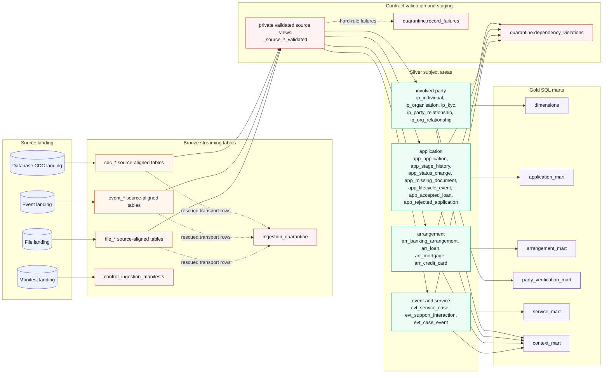

# 0-ai-trust pipeline dependency map

The Databricks graph is generated dynamically from the dataset registries and
the Silver model registration functions. The diagram below is intentionally
grouped by source type and subject area so that it remains readable. The
actual pipeline still creates one Bronze table and one Silver entity for every
dataset listed in the registries.

## Why the native Databricks graph looks complicated

The graph contains more nodes than the business model because one Python
registration call expands into several pipeline objects. For each Silver
entity, the framework can create a private validation view, expectation rules,
a quarantine flow, and either an AUTO CDC SCD2 target or an append-only
streaming target. These are implementation nodes, not additional business
tables.

There are also four different dependency patterns. Direct CDC entities use
`create_auto_cdc_flow`, immutable entities use a streaming table with a
watermark and deduplication, joined entities use a private materialized view
followed by `create_auto_cdc_from_snapshot_flow`, and cross-entity checks read
several canonical Silver tables to produce dependency violations. The UI draws
all of these edges, including validation and quarantine branches, which makes
the screenshot appear tangled.

The source-to-Bronze side is intentionally fan-out. The registry loops create
one source-aligned table for every database, event, and file dataset so that
each dataset keeps its own schema, checkpoint, CDF history, and lineage. This
is safer for schema evolution and replay than one universal Bronze table, but
it produces many parallel nodes in the UI.

The grouped diagram is therefore the useful communication view. The Databricks
lineage view remains the operational view for tracing one concrete dataset,
rule, or failure record.
